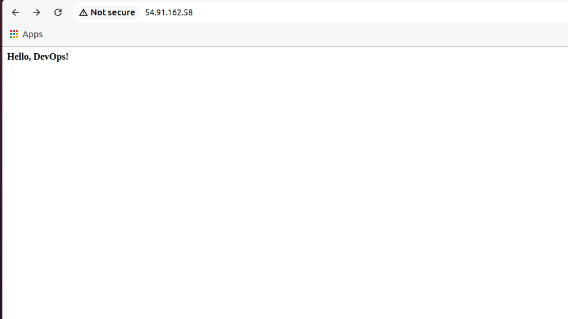

### Launch an EC2 Instance
- Log in to the AWS Management Console and navigate to the EC2 service.
- Click on "Launch Instance" and select the "Amazon Linux" and then from dropdown select "Amazon Linux 2" AMI.
- Choose the "t2.micro" instance type.
- Configure the VPC, subnet and auto assign public IP.
- Create a new security group or select an existing one in which all ssh(22) on your IP only and http/https for public (0.0.0.0/0). Allow all out going traffic for now.
- Optional: I am using spot instance for cost saving 
 - Create or select an existing key pair to connect to the instance via SSH.
 - In user data add below command so that hostname is automatically set
	```
	#!/bin/bash
    hostnamectl set-hostname web-server-1
    ``` 
### Connect to the EC2 Instance
- Once the instance is running, use to public IP to ssh into the server
- Use the below command
    ```
        ssh -i <path to keyfile> ec2-user@<ip_address>
	```
	
### Install Nginx Web Server 
- Once you are inside the server via SSH, run the below commands to install nginx
```
        sudo amazon-linux-extras list | grep nginx
        sudo amazon-linux-extras install nginx1
        sudo systemctl start nginx
        sudo systemctl enable nginx
```

### Configure Nginx server
- Create the file and add below text *** sudo vim /etc/nginx/conf.d/mywebsite.conf ***
```
        server { 
            listen 80;
            server_name mywebsite.com www.mywebsite.com;
            location / { 
                root /var/www/html; 
                index index.html; 
            }
        }
```
- Create root directory for nginx
  ```
  mkdir -p /var/www/html
  ```

- Create index.html in above directory with below contents
```
        <html>
        <head>
	        <title>My Website</title>
        </head>
        <body>
	        <h4>Hello, DevOps!</h4>
        </body>
        </html>
```

- Use the below command to make sure there is no issue in nginx configuration
 ```
		  nginx -t
```

- Once verified, restart the nginx sevice
 ```
        systemctl restart nginx
 ```

- Enter the public IP in the browser and you should get the expected output
- Output
    
 
### Running Webserver on https
- Make the below changes in webserver.conf file
```        
        server { 
            listen 443 ssl;
            server_name mywebsite.com www.mywebsite.com;
            ssl_certificate /path/to/ssl_cert/final.crt;
            ssl_certificate_key /path/to/your_private.key;
            location / { 
                root /var/www/html; 
                index index.html; 
            }
        }
```
- Added DNS entry (A record)
- Verify nginx configuration using **nginx -t** command and restart nginx
- Enter the DNS name in browser as below
        https://mywebserver.com
